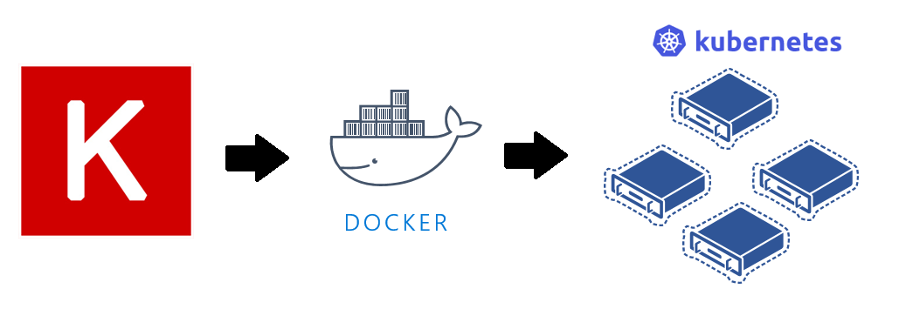
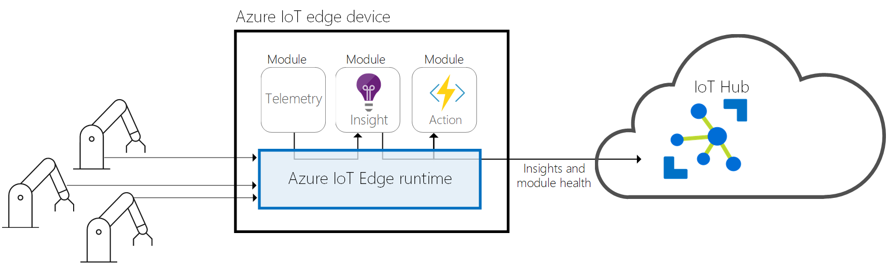

### Authors: Yan Zhang and Ilia Karmanov

# Deploying Deep Learning Models on Kubernetes Cluster and on Azure IoT Edge

It is often a non-trivial task to deploy machine learning (ML) models. In this post, we show two types of model deployments: model deployment on a Kubernetes cluster; and model deployment on Azure IoT Edge.

In this [previous work](https://github.com/ilkarman/DeepLearningFrameworks), we aim to create a Rosetta stone of deep learning (DL) frameworks by using common code for several different network structures. Taking one of these network structures as an example, we show how to deploy a trained Keras (tensorflow) CNN model. The objective of this multi-class classification problem is to perform object recognition in images on [CIFAR-10 data set](https://www.kaggle.com/c/cifar-10). The same model deployment approaches are also applicable to other ML models, not just DL.

## Model Deployment on Kubernetes Cluster

We deploy the model on a Kubernetes cluster as a web service via [Machine Learning CLI](https://docs.microsoft.com/en-us/azure/machine-learning/service/overview-what-is-azure-ml). 

Comparing with this previous [ACS deployment tutorial](https://github.com/Azure/ACS-Deployment-Tutorial), this approach simplifies the model deployment process by using a set of Azure ML CLI commands. With this tool, it becomes straightforward to take the containerized approach - Docker container, to overcome the dependency problems for ML model deployment. It makes it convenient to initialize your Azure machine learning environment with a storage account, ACR registry, App Insights service, and other Azure resources by executing very few CLI commands and deploy the model to the cluster. Source code and full documentation are linked below.

Specifically, the major steps taken for deploying a Keras model is shown in following diagram. First of all, we need to get the trained model, scoring script, and conda dependency file ready in a local directory. Secondly, we provision necessary Azure resources such as a model management account, and the Kubernets cluster on which the model will model will be deployed. Lastly, we deploy the web service.

## Model Deployment on Azure IoT Edge

With the completion of the previous task, we introduce how to deploy an ML module through [Azure IoT Edge](https://docs.microsoft.com/en-us/azure/iot-edge/how-iot-edge-works). 

Azure IoT Edge is an Internet of Things (IoT) service that builds on top of Azure IoT Hub. It is a hybrid solution combining the benefits of the two scenarios: *IoT in the Cloud* and *IoT on the Edge*. This service is meant for customers who want to analyze data on devices, a.k.a. "at the edge", instead of in the cloud. By moving parts of your workload to the edge, your devices can spend less time sending messages to the cloud and react more quickly to changes in status. On the other hand, Azure IoT Hub provides centralized way to manage Azure IoT Edge devices, and make it easy to train ML models in the Cloud and deploy the trained models on the Edge devices.  

In this example, we deploy a trained Keras (tensorflow) CNN model to the edge device. When the image data is generated from a process pipeline and fed into the edge device, the deployed model can make predictions right on the edge device without accessing to the cloud. Following diagram shows the major components of an Azure IoT edge device. Source code and full documentation are linked below.

We perform following steps for the deployment.

- Step 1: Build the trained ML model into docker image. This image will be used to create a docker container running on the edge device. 
- Step 2: Provision and Configure IoT Edge Device
- Step 3: Deploy ML Module on IoT Edge Device
- Step 4: Test ML Module

## Prerequisite 

- Azure subscription
- Data Science Virtual Machine (DSVM) on Azure
    
    In this example, we use Deep Learning Virtual Machine - Linux OS, Standard [NC6 (6 vcpus, 56 GB memory) machine](https://azure.microsoft.com/en-us/blog/azure-n-series-preview-availability/) as the compute resource, where we train and deploy the model. Other types of Azure Linux VM should work as well. The difference is that the model trainning can take longer time (~ 1 hour).  To provision a DLVM, please see [these instructions](https://docs.microsoft.com/en-us/azure/machine-learning/data-science-virtual-machine/provision-deep-learning-dsvm). 

    We use following tools on this DSVM.
    - Python 3
    - Jupyter Notebook 
    - Azure CLI  

## Getting Started
Source code and full documentation are available in following notebooks. You are suggested to use run them in a sequential order. 

- [Keras_TF_CNN_DeployModel.ipynb](Keras_TF_CNN_DeployModel.ipynb)
- [Keras_TF_CNN_DeployModel_IoTEdge.ipynb](Keras_TF_CNN_DeployModel_IoTEdge.ipynb)

# Contributing

This project welcomes contributions and suggestions.  Most contributions require you to agree to a
Contributor License Agreement (CLA) declaring that you have the right to, and actually do, grant us
the rights to use your contribution. For details, visit https://cla.microsoft.com.

When you submit a pull request, a CLA-bot will automatically determine whether you need to provide
a CLA and decorate the PR appropriately (e.g., label, comment). Simply follow the instructions
provided by the bot. You will only need to do this once across all repos using our CLA.

This project has adopted the [Microsoft Open Source Code of Conduct](https://opensource.microsoft.com/codeofconduct/).
For more information see the [Code of Conduct FAQ](https://opensource.microsoft.com/codeofconduct/faq/) or
contact [opencode@microsoft.com](mailto:opencode@microsoft.com) with any additional questions or comments.
