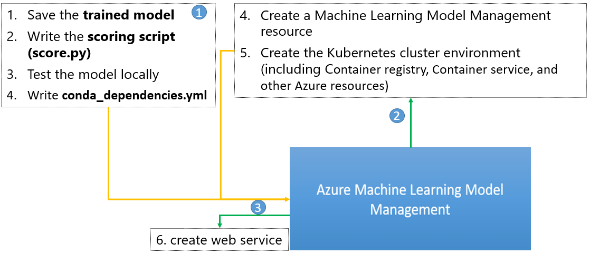

### Authors: Yan Zhang and Ilia Karmanov

# Deploying Deep Learning Models on Azure Container Service and on Azure IoT Edge

It is often a non-trivial task to deploy machine learning (ML) models. In the work shown in [this repo](https://github.com/ilkarman/DeepLearningFrameworks), we aim to create a Rosetta stone of deep-learning frameworks by using common code for several different network structures. We mainly show the network training and evaluation process across many different frameworks. With this work, we further introduce a model deployment approach for a trained machine learning model. As an example, we show how to deploy the trained Keras (tensorflow) model, which is one of the deep learning models from above mentioned deep learning framework comparison task. 

We introduce two types of model deployments: model deployment on Azure Container Service (ACS); and model deployment on Azure IoT Edge. In this tutorial, the former is a prerequisite of the latter.

## Model Deployment on ACS 

We deploy the model on Azure Container Service (ACS) as a web service via Azure CLI [Machine Learning Model Management]( https://docs.microsoft.com/en-us/azure/machine-learning/preview/model-management-overview). This approach is also applicable to other ML models, not just DL.

Comparing with the previous [ACS deployment tutorial](https://github.com/Azure/ACS-Deployment-Tutorial), this approach simplifies the model deployment process by using a set of model management commands. With this model management tool, it becomes straightforward to take the containerized approach - Docker container, to overcome the dependency problems for ML model deployment. It makes convenient to initialize your Azure machine learning environment with a storage account, ACR registry, App Insights service, and other Azure resources by executing very few CLI commands. You can also easily scale ACS Kubernetes cluster, as introduced in the blog post [Scaling Azure Container Service Clusters](https://blogs.technet.microsoft.com/machinelearning/2018/03/20/scaling-azure-container-service-cluster/).

Specifically, the major steps taken for deploying a Keras model is shown in following diagram. First of all, we need to get the trained model, scoring script, and conda dependency file ready in a local directory. Secondly, we provision necessary Azure resources such as a model management account, and the Kubernets cluster on which the model will model will be deployed. Lastly, we deploy the web service.

## Model Deployment on Azure IoT Edge

With the completion of the previous task, we introduce the steps of deploying an ML module through [Azure IoT Edge](https://docs.microsoft.com/en-us/azure/iot-edge/how-iot-edge-works). The purpose is to deploy a trained image classification model to the edge device. When the image data is generated from a particular process pipeline and fed into the edge device, the deployed model is able to make predictions right on the edge device without accessing to the cloud.  

## Prerequisite 

- Azure subscription
- Data Science Virtual Machine (DSVM) on Azure
    
    In this example, we use Deep Learning Virtual Machine - Linux OS, Standard [NC6 (6 vcpus, 56 GB memory) machine](https://azure.microsoft.com/en-us/blog/azure-n-series-preview-availability/) as the compute resource, where we train and deploy the model. Other types of Azure Linux VM should work as well. The difference is that the model trainning can take longer time (~ 1 hour).  To provision a DLVM, please see [these instructions](https://docs.microsoft.com/en-us/azure/machine-learning/data-science-virtual-machine/provision-deep-learning-dsvm). 

    The Deep Learning Virtual Machine (DLVM) is a specially configured variant of the Data Science Virtual Machine (DSVM) to make it easier to use GPU-based VM instances for training deep learning models. It is supported on Windows 2016, or the Ubuntu Data Science Virtual Machine and shares the same core VM images (and hence all the rich toolset) as the DSVM. We also provide end-to-end AI samples for image and text understanding. The deep learning virtual machine also makes the rich set of tools and samples on the DSVM more easily discoverable. In terms of the tooling, the Deep Learning Virtual Machine provides several popular deep learning frameworks, tools to acquire and pre-process image, textual data.
    
    We use following tools on this DSVM.
    - Python 3
    - Jupyter Notebook 
    - Azure CLI  

## Getting Started
Source code and full documentation are available in below notebooks. You are suggested to use these two notebooks in a sequential order. 

- [Keras_TF_CNN_DeployModel.ipynb](Keras_TF_CNN_DeployModel.ipynb)
- [Keras_TF_CNN_DeployModel_IoTEdge.ipynb](Keras_TF_CNN_DeployModel_IoTEdge.ipynb)

# Contributing

This project welcomes contributions and suggestions.  Most contributions require you to agree to a
Contributor License Agreement (CLA) declaring that you have the right to, and actually do, grant us
the rights to use your contribution. For details, visit https://cla.microsoft.com.

When you submit a pull request, a CLA-bot will automatically determine whether you need to provide
a CLA and decorate the PR appropriately (e.g., label, comment). Simply follow the instructions
provided by the bot. You will only need to do this once across all repos using our CLA.

This project has adopted the [Microsoft Open Source Code of Conduct](https://opensource.microsoft.com/codeofconduct/).
For more information see the [Code of Conduct FAQ](https://opensource.microsoft.com/codeofconduct/faq/) or
contact [opencode@microsoft.com](mailto:opencode@microsoft.com) with any additional questions or comments.
